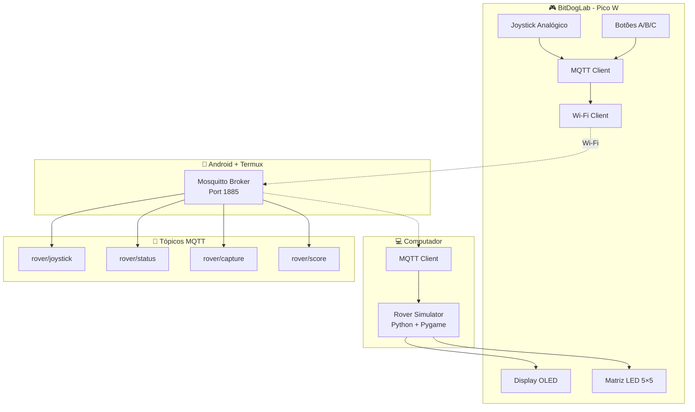

# Rover Simulator IoT 🚀


**Rover Simulator IoT** é um sistema completo de controle remoto distribuído utilizando protocolo MQTT – firmware embarcado, simulação visual e arquitetura IoT – construído sobre a **Raspberry Pi Pico W** e a baseboard  **BitDogLab** . Ele oferece:

* **Comunicação MQTT bidirecional** para controle em tempo real via Wi-Fi.
* **Joystick analógico calibrado** com controle preciso de movimento (X/Y).
* **Display OLED SSD1306 128×64** para status de conexão e pontuação.
* **Matriz WS2812 5×5** com feedback visual baseado em estados do sistema.
* **Simulador Python com Pygame** – ambiente 2D, coleta de pontos e obstáculos.
* **Broker MQTT móvel** executando em Android via Termux + Mosquitto.
* **Arquitetura IoT distribuída** com múltiplos clientes e monitoramento.

> Projeto mantido por **Heitor Rodrigues Lemos Dias** – Código aberto sob Licença MIT.

---

## 📂 Estrutura do repositório

| Caminho                              | Descrição                                                  |
| ------------------------------------ | ------------------------------------------------------------ |
| `plataforma-mqtt.c`                | Cliente MQTT principal, controle de hardware e comunicação |
| `rover_simulation.py`              | Simulador Python do rover com Pygame e cliente MQTT          |
| `ws2812.pio`                       | Programa PIO para controle da matriz LED                     |
| `lib/ssd1306.c`·`lib/ssd1306.h` | Driver I²C para display OLED                                |
| `lib/font.h`                       | Fonte bitmap para renderização de texto                    |
| `CMakeLists.txt`·`cmake/`       | Scripts de build e configuração do projeto                 |
| `README.md`                        | Este arquivo de documentação                               |

---

## 🔧 Requisitos

### Hardware

| Componente                            | Qtde | Observação                                   |
| ------------------------------------- | ---: | ---------------------------------------------- |
| **Raspberry Pi Pico W**         |    1 | Com conectividade Wi-Fi integrada              |
| **BitDogLab baseboard**         |   – | Integra joystick, botões, matriz WS2812, OLED |
| **Smartphone Android**          |    1 | Para executar broker MQTT via Termux           |
| **Computador**                  |    1 | Para executar simulador Python                 |
| Display**OLED SSD1306 128×64** |    1 | I²C – já presente na BitDogLab              |
| Matriz**WS2812 5×5**           |    1 | PIO – já presente na BitDogLab               |
| **Rede Wi-Fi**                  |   – | Para comunicação entre dispositivos          |

> **Usa hardware próprio?** Ajuste as macros de GPIO em `plataforma-mqtt.c` e configure os pinos adequadamente.

### Software

| Ferramenta                     | Versão mínima            |
| ------------------------------ | -------------------------- |
| **Pico SDK**             | 1.5.0 (validado com 2.1.1) |
| **CMake**                | 3.13                       |
| **GNU Arm GCC**          | 10.3‑2021.10              |
| **Python**               | 3.8+                       |
| **Pygame**               | 2.0+                       |
| **paho-mqtt**            | 1.6+                       |
| **Termux** *(Android)* | Última versão            |

---

## ⚙️ Configurando o sistema

### Método ① – Configuração do Broker MQTT (Android + Termux)

1. Instale **Termux** da Google Play Store ou F-Droid.
2. Atualize e instale o Mosquitto:

```bash
pkg update && pkg upgrade
pkg install mosquitto
```

3. Configure o broker:

```bash
echo "listener 1885" > $PREFIX/etc/mosquitto/mosquitto.conf
echo "allow_anonymous true" >> $PREFIX/etc/mosquitto/mosquitto.conf
echo "log_dest stdout" >> $PREFIX/etc/mosquitto/mosquitto.conf
```

4. Execute o broker:

```bash
mosquitto -c $PREFIX/etc/mosquitto/mosquitto.conf -v
```

5. Anote o **IP do Android** para configurar os clientes.

### Método ② – Compilando o firmware (Pico W)

```bash
# Clonar o projeto
git clone https://github.com/TorRLD/iot-mqtt-rover.git
cd iot-mqtt-rover

# Configurar credenciais Wi-Fi em plataforma-mqtt.c
#define WIFI_SSID     "SUA_REDE"
#define WIFI_PASSWORD "SUA_SENHA"
#define BROKER_IP     "IP_DO_ANDROID"

# Build do projeto
mkdir build && cd build
cmake .. -DPICO_BOARD=pico_w
make -j$(nproc)

# Flash no Pico W
# 1. Segure BOOTSEL, conecte USB, solte BOOTSEL
# 2. Copie o arquivo .uf2 para a unidade RPI-RP2
```

### Método ③ – Configurando o simulador Python

```bash
# Instalar dependências
pip install pygame paho-mqtt

# Configurar IP do broker em rover_simulation.py
MQTT_BROKER_IP = "IP_DO_ANDROID"
MQTT_BROKER_PORT = 1885

# Executar simulador
python rover_simulation.py
```

---

## 🕹️ Operação

### Mapeamento de controles BitDogLab

| Controle                     | Ação                    | Feedback                                          |
| ---------------------------- | ------------------------- | ------------------------------------------------- |
| **Joystick X/Y**       | Movimento do rover        | Simulador atualiza posição em tempo real        |
| **Botão A (GPIO 5)**  | Capturar pontos próximos | LED**verde** , beep, pontuação no display |
| **Botão B (GPIO 6)**  | Ligar/desligar luzes      | LED**amarelo** , status no simulador        |
| **Botão C (GPIO 22)** | Ativar/desativar câmera  | Indicação visual no simulador                   |

### Codificação de estados da matriz WS2812

| Estado do sistema  | Cor      | Significado                 |
| ------------------ | -------- | --------------------------- |
| Desconectado       | Vermelho | Erro de conexão Wi-Fi/MQTT |
| Conectando         | Amarelo  | Estabelecendo conexão      |
| Conectado (normal) | Azul     | Sistema operacional         |
| Capturando ponto   | Verde    | Ponto coletado com sucesso  |

### Tópicos MQTT utilizados

| Tópico            | Direção           | Payload de exemplo                                         |
| ------------------ | ------------------- | ---------------------------------------------------------- |
| `rover/joystick` | Pico W → Simulador | `{"speed":75.5,"steering":-32.1,"mode":0,"lights":"on"}` |
| `rover/status`   | Pico W → Simulador | `{"lights":"off","camera":"on"}`                         |
| `rover/capture`  | Pico W → Simulador | `{"capture":true}`                                       |
| `rover/score`    | Simulador → Pico W | `score=250`                                              |
| `rover/hello`    | Bidirecional        | `HELLO`/`hello_ack=true`                               |
| `rover/commands` | Simulador → Pico W | `hello_ack=true`                                         |

---

## 📡 Diagrama de arquitetura



> A arquitetura **distribuída** permite controle em tempo real através de rede Wi-Fi, com latência mínima para jogabilidade fluida.

---

## 🎯 Modos de simulação

### Modo Manual 🕹️

* **Controle total via joystick** BitDogLab
* **Feedback imediato** no simulador
* **Ideal para demonstrações** interativas

### Modo Semi-automático 🤖

* **Assistência anti-colisão** automática
* **Joystick + algoritmos** de segurança
* **Evita obstáculos** automaticamente

### Modo Autônomo 🎯

* **Rover busca pontos** automaticamente
* **Algoritmo de pathfinding** integrado
* **Demonstra IA básica** embarcada

---

## 🐛 Troubleshooting

### Problemas comuns

| Problema                         | Solução                                          |
| -------------------------------- | -------------------------------------------------- |
| **MQTT não conecta**      | Verificar IP do broker, firewall e rede Wi-Fi      |
| **Joystick descalibrado**  | Ajustar `ADC_CENTER_X/Y`em `plataforma-mqtt.c` |


---

## 🤝 Contribuindo

1. Faça *fork* e crie branch: `git checkout -b feat/minha-funcionalidade`.
2. Codifique seguindo boas práticas de IoT e sistemas embarcados.
3. Teste em hardware real antes de submeter.
4. Abra **Pull Request** explicando  *Problema ➜ Solução ➜ Testes* .

Pull requests bem documentados e testados são muito bem‑vindos!

---

## 📝 Licença

Distribuído sob a **Licença MIT** – veja [`LICENSE`](LICENSE) para detalhes.

---

## 📞 Contato

**Heitor Lemos**

🔗  **GitHub** : [TorRLD](https://github.com/TorRLD)

---
